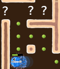

# Spring Challenge 2020 post-mortem
Here is my post mortem of the [spring challenge 2020](https://www.codingame.com/contests/spring-challenge-2020), where I finished 1st.

I was a bit confused at the beginning of the contest and wasn't sure about which direction to go. 
 Is it better to simulate precisely the enemy, 
but then stay at low depth due to branching factor? Or is it better to make a deep search to farm well, knowing it would
 be hard to simulate the enemy moving, and that this expected farm might not go well? On top of that there was a fog of war I didn't know how to handle. So I spent the first
 days writing an efficient simulation with bitboards, and trying to deal with the fog of war. 
 At the middle of the week I wasn't able to do anything good with bruteforce and decided it was the time to come back to the good old GA,
 without being sure of where it would lead me.

## Genetic Algorithm

In order to simulate the opponent, we have seen from past contest players allowing some time to compute the opponent 
search, take the best version of it, and then do their own simulation against this specific version. The drawback of
 this method is the fact that the own search will probably be over optimized against a specific plan of actions.

So, I went for another method: I keep two population of individuals, one for me and one for the opponent
. Alternatively, I play one generation for me, then one for the opponent, one for me… until I run out of time. 
At each generation I keep the best individual, and the next generation will be played against this best version. 
That way, both me and the opponent will keep improving and reacting to the other. 

### Individuals
Usually the genes represent the actions you will make during the turn. However for this contest I felt like it wasn’t a 
good idea to do so : depending on if you enter a collision or if you can be eaten by another pac you have to adapt your
 moves and abilities. So my genes are actually only an array of cells that the pac will try to follow during the 
 simulation. I went to depth 6, so an individual is multiple arrays (one for each pac) of 11 cells. In order to generate 
 a list of cells I start from the pac, and do random moves with a low probability of turning back. Mutations are
  generated by taking a random point of the array and regenerate the end of it. I couldn’t really do cross overs
  , instead 
  when two individuals are merged I take for each pac the array of one of the 2 individuals randomly… we’re a bit far 
  from “classical” GA, but why not.

### Heuristics
When I want to run a simulation (the execution of one individual for me and one for the opponent), at each depth I
 choose the actions the pacs will take according to the game state and the arrays : 
-	If a pac can be eaten, or want to go to a dangerous cell he will fly away instead, or switch if flying away is not an option.
-	Boost if his cooldown is 0 and if we has not been blocked by a collision at the previous turn.
-	Move to the next cell in the array otherwise.

The simulation take place, and this procedure is repeated until full depth is reached. 

### Evaluation

The final game state is then evaluated with an evaluation function that takes into account:
-	The scores. One trick I added was to give a score of 1.0 for eating a pellet that I'm sure is still alive, and otherwise 
a score equal to the probability of the pellet to be still there : the number of remaining pellets divided by the number of 
potential cells that could still have a pellet. This probability is equal to 1.0 at the beginning and then decrease. It
 was useful 
for late game as it avoids a pac not going for a visible pellet because it though that there were 10 others behind this corner...
which have of course already been eaten.
-	Kills and deaths: there are worth a number of pellets equal to the remaining pellets divided by the numbers of
 pacs.
-	A voronoï giving points for each pellets by taking into account the distance from the pac with a `0.9 ^ distance` coefficient. Finding the right balance between the scores and the voronoï was worth a lot of ELO.

## Dealing with fog of war

### Enemy tracking

To be honest I had very low motivation to deal with incomplete information, as it was the third contest in a row with
 this kind of stuff and this time it felt way harder than usual to bruteforce the enemy possibilities and prune them
  to only keep the valid ones.
  
  So I did the easiest thing I could do with little time: as my simulation also gives me actions for the enemy which
   are supposed to be good ones, I use those actions from the previous turn to predict the positions of the pacs, and eat the pellets
    accordingly. As soon as one pac become invalid (either because I see him elsewhere, or because I see a remaining
     pellet that should have been eaten), I remove this pac from my list and doesn't consider him to be alive as long as
      I don't see him again.  

### Pellets removing

Even without a precise enemy tracking, it was possible to remove a lot of pellets. 

#### With enemy pacs information

When I see an enemy pac again, I compute the maximal distance the pac could have travelled, according to
 the number of turns since I haven't seen him and his cooldowns. Then I compute all the possible paths he could have
  taken to go from his initial position to his final one, and I remove the pellets which belongs in all those paths
  . For the paths, I also remove the ones which pass through an existing pellet at the last turn. Here I could have also
   taken
   the information of the previous turns, but once again it would have been way more complicated (MSmith explained it
    very well). 
   
#### With the visible empty cells

I found 2 cases where you can suppose that the pellets have been eaten:

Here you see that the beginning of the corridor has already been cleared, so you can deduce that the following
 pellets with the question mark have probably been eaten too.
 

 
 When I see an empty intersection with 2 empty or unknown cells, that's probably because a pac went through this
  intersection, and so the corridors adjacent to those 2 cells are surely empty too. 
  
## Misc

### Attack and defense

As you can see there are not a lot of stuff to try to kill the enemies, no aggressive switch but my AI will sometimes
 pick a
kill if it is in a situation where the enemy can't do anything. In order to make those situations more frequent (and prevent
myself from suffering the same fate), I tried to give a bonus to my pacs if they where close to an enemy
 that they could eat, and a malus if they where close to an enemy that could eat them, but unfortunately it didn't gave good
  results. 

### Super pellets
At the end of the contest I realized I was losing a lot of games because I only got 1 out of the 4 super pellets. It
 actually came from 2 problems:
-	My pacs weren’t interesting enough about super pellets that were far from them, even if they could be the first
 pac to reach it. I did a quick change by computing at the beginning what was the best combination between pacs and
  super pellets to be sure to eat 2, and add it in my evaluation to force those pacs to move closer to the 2 pellets.
- The second one is actually a big mistake from me: when I wrote my first eval, I somehow considered that I didn't
 need a patience coefficient for the pellets eating. While it might not be that wrong for normal pellets, it was
  definitely not the case for the super ones, as my pacs would sometimes take their times before eating a super
   pellets, that ended up being eaten by an unexpected enemy. I only realized it right after the contest. Thanks to the
    multi I could test it: after 5 minutes of code to add a `0.9 ^ depth` patience coefficient and 800 games, I could saw my 
    winrate going from 56% to 62% against the contest top 5... I'm lucky this didn't cost me the win !

## Conclusion

At the beginning I wasn’t super convinced about the contest considering the fact that we had to do lot of stuff about
 FoW but I found it to be more and more interesting when things started to work without having to do complicated stuff 
with the enemy tracking.

I'm obviously very happy to win my second contest, and this one feels even more satisfying as BotG was more about 
heuristics than running a good search algorithm on a simulation. 

Thanks to CodinGame for organizing those contests, and to all the many other participants !

